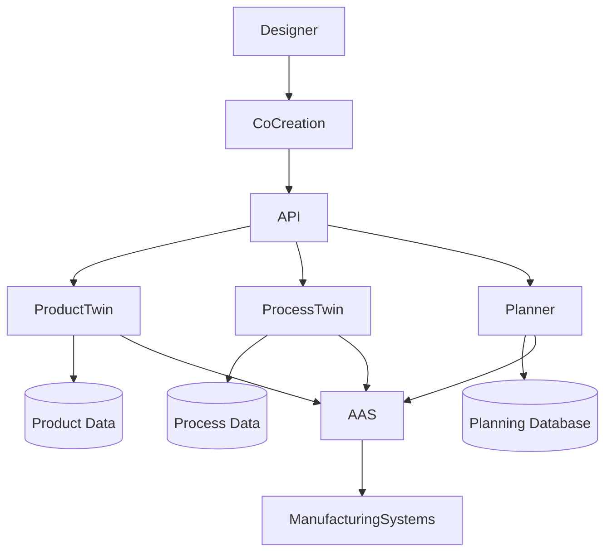
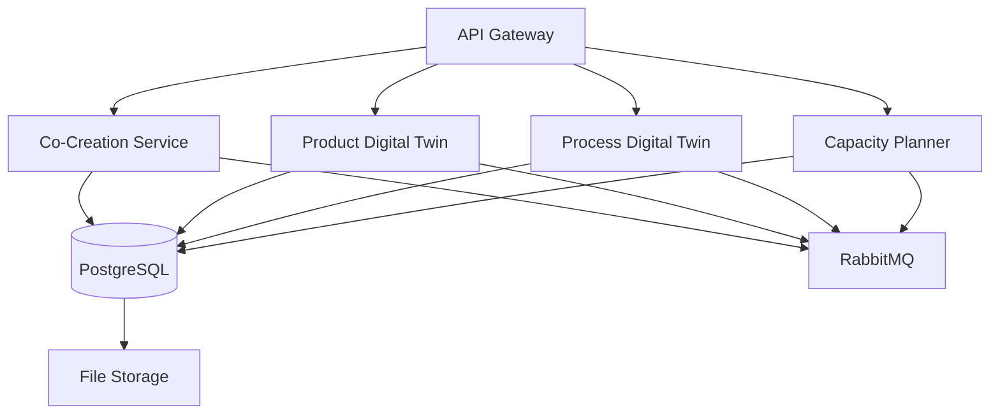
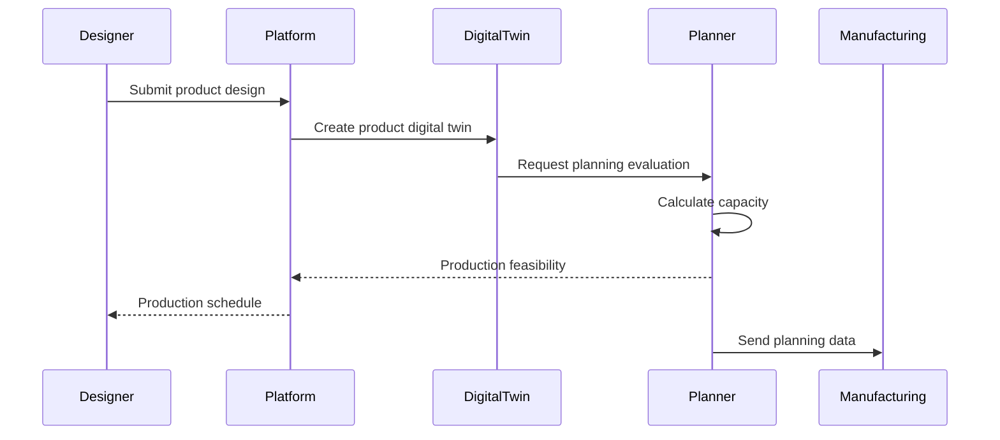

# R3GROUP — Katty Fashion Digital Manufacturing Platform

> Katty Fashion pilot implementation for the **R3GROUP Horizon Europe project**, enabling resilient and rapidly reconfigurable garment production through Digital Twins and digital manufacturing tools.

---

## Quick Links

| Resource | Link |
|---|---|
| KF Dashboard | [katty-fashion.github.io/kf-cpto](https://katty-fashion.github.io/kf-cpto/) |
| Unified Kanban | [katty-fashion.github.io/kf-cpto/unified-kanban.html](https://katty-fashion.github.io/kf-cpto/unified-kanban.html) |
| R3GROUP Project | [cordis.europa.eu/project/id/101091869](https://cordis.europa.eu/project/id/101091869) |

---

## Overview

**R3GROUP (Resilient Rapid Reconfigurable Production Process Chains)** is a Horizon Europe project that develops technologies for **resilient, digitally integrated manufacturing systems**.

The project aims to improve industrial production by enabling:

- rapid reconfiguration of production lines
- integration of digital twins across manufacturing systems
- real-time monitoring and control of production processes
- interoperability between production assets using **Asset Administration Shell (AAS)** standards
- improved collaboration across the supply chain

The **Katty Fashion pilot** focuses on applying these technologies to the **garment manufacturing industry**, connecting product design with manufacturing preparation and production planning.

---

## Core Digital Concepts

### Digital Twin

A **Digital Twin** is a digital representation of a physical object or process.

In R3GROUP this includes:

- product digital twins
- process digital twins
- production system digital twins

Digital twins allow simulation, monitoring and optimization of manufacturing workflows.

---

### Asset Administration Shell (AAS)

The **Asset Administration Shell (AAS)** is a standardized digital interface used to represent manufacturing assets.

It enables interoperability between:

- machines
- software platforms
- digital twins
- production systems

---

### Digital Thread

The **Digital Thread** represents the continuous data flow that connects:

- product design
- production planning
- manufacturing execution
- product lifecycle monitoring

This digital connectivity enables data-driven decision making and faster production adaptation.

---

## Platform Architecture

### System Architecture Overview



---

### Main Platform Components

#### 1. Co-Creation Platform

The Co-Creation Platform provides a collaborative environment where designers, suppliers and manufacturers can work together on product development.

Capabilities include:

- product specification management
- technical pack exchange
- design collaboration
- order lifecycle tracking

The platform improves communication between stakeholders and supports collaborative decision-making across the production workflow.

---

#### 2. Product Digital Twin

The Product Digital Twin represents each garment as a digital object.

It includes:

- design specifications
- material information
- technical documentation
- manufacturing parameters

**Benefits:**

- centralized product documentation
- traceability across the product lifecycle
- improved collaboration between design and production teams
- digital integration of design and manufacturing data

---

#### 3. Process Digital Twin

The Process Digital Twin models manufacturing workflows and production systems.

It supports:

- production simulation
- capacity analysis
- workflow optimization
- production reconfiguration planning

By simulating different production scenarios, the process digital twin helps manufacturers evaluate the impact of production changes before implementing them.

---

#### 4. Technician Capacity Planner

The Technician Capacity Planner is a scheduling tool designed for the technician department at Katty Fashion.

It helps the development manager plan preparation activities required before manufacturing begins.

**Core functions:**

- technician workload visualization
- scheduling production preparation tasks
- evaluating department capacity
- adapting planning based on order changes

**Interface features:**

- interactive planning calendar
- workload indicators
- drag-and-drop scheduling
- dynamic resource allocation

The system centralizes technician scheduling data in a unified interface and enables dynamic rescheduling based on operational events such as delays or resource availability changes.

---

### Microservice Architecture



---

### Data Flow



---

## Kanban Management

This repository integrates with the [KF-CPTO](https://katty-fashion.github.io/kf-cpto/) Git-native project management dashboard.

The project uses a `kanban.md` file as the single source of truth for task tracking.

Updating this file automatically updates:

- unified Kanban board
- sprint calendar
- LOE reports
- dependency graph

---

## Development

### Prerequisites

- Node.js 20+
- Python 3.11+
- Docker
- Docker Compose
- Kubernetes *(optional)*

### Setup

```bash
git clone https://github.com/katty-fashion/r3group-kf.git
cd r3group-kf
```

Install dependencies:

```bash
npm install
```

### Run Locally

```bash
docker compose up
```

---

## Repository Structure

```
r3group-kf/
│
├── kanban.md
├── README.md
├── .github/
│   └── workflows/
│       └── notify-kf-cpto.yml
│
├── src/
│   ├── api/
│   ├── planner/
│   ├── digital-twin/
│   ├── services/
│   └── utils/
│
├── docs/
├── tests/
│
├── Dockerfile
└── docker-compose.yml
```

---

## Team

| Role | Contact |
|---|---|
| Product Owner | ps.tech@katty-fashion.ro |
| Tech Lead | el.tech@katty-fashion.ro |
| Front-End | alexandru.bejenari@katty-fashion.ro |
| Back-End | razvan.boita@katty-fashion.ro |

---

## Project Information

| Field | Details |
|---|---|
| **Project** | R3GROUP |
| **Full Name** | Resilient Rapid Reconfigurable Production Process Chains |
| **Programme** | Horizon Europe |
| **Grant Agreement** | 101091869 |

The project develops technologies that enable rapidly reconfigurable manufacturing systems using digital platforms, digital twins and advanced planning tools.

The Katty Fashion pilot demonstrates these technologies in the garment manufacturing sector, integrating product design, production preparation and manufacturing processes through digital tools.

---

## Ecosystem

*Part of the Katty Fashion Digital Manufacturing Ecosystem.*

Connected projects include:

- AI-RISE
- AI-REGIO
- NUOFORM
- Waste Management Platform
