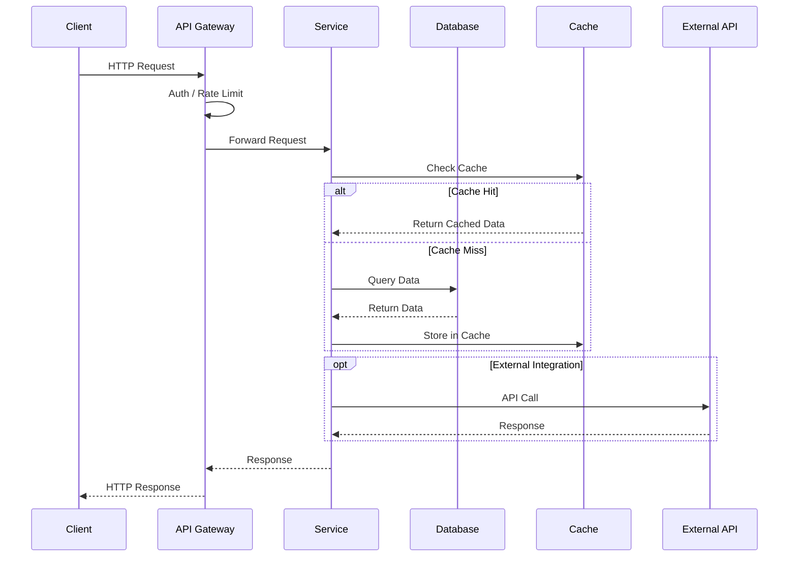
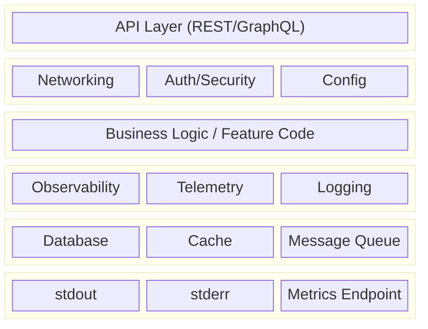
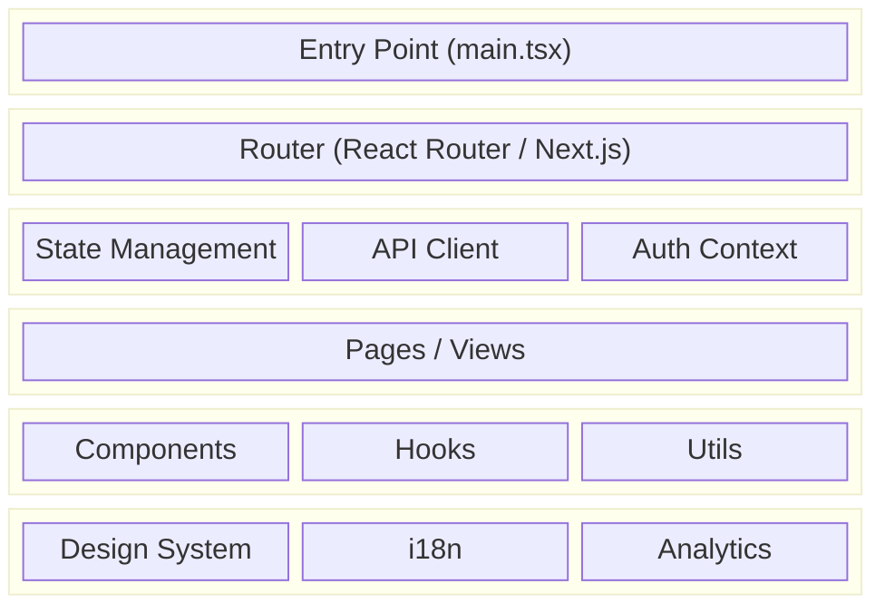

# {PROJECT_NAME}

> {PROJECT_DESCRIPTION}

## Quick Links

- [KF Dashboard](https://katty-fashion.github.io/kf-cpto/) — Unified project view
- [Project Page](https://katty-fashion.github.io/kf-cpto/projects/{project-name}/) — Auto-generated from kanban
- [Unified Kanban](https://katty-fashion.github.io/kf-cpto/unified-kanban.html) — All tasks across KF Team

---

## Architecture

### High-Level Design (HLD) — Sequence Flow



### Backend Service Anatomy

Every backend service/container follows this standard architecture:



**Layer Responsibilities:**

| Layer | Components | Purpose |
| :--- | :--- | :--- |
| **API Layer** | REST endpoints, GraphQL resolvers | External interface |
| **Infrastructure** | Network config, TLS, CORS, Auth middleware | Cross-cutting concerns |
| **Business Logic** | Domain models, services, handlers | Your feature code |
| **Observability** | OpenTelemetry, Prometheus, structured logs | Monitoring & debugging |
| **I/O** | PostgreSQL, Redis, RabbitMQ/Kafka | Data persistence & messaging |
| **Output** | stdout (logs), stderr (errors), /metrics | Container output streams |

**Minimum Requirements for Production:**

```yaml
# Every service must have:
observability:
  - health_check: /health
  - readiness: /ready
  - metrics: /metrics (Prometheus format)
  - tracing: OpenTelemetry spans

logging:
  - format: JSON structured
  - output: stdout (info), stderr (errors)
  - correlation_id: request tracing

config:
  - env_vars: 12-factor app
  - secrets: mounted from vault/k8s secrets
  - feature_flags: runtime toggles
```

### Frontend (React Web) Anatomy



**Frontend Layer Responsibilities:**

| Layer | Components | Purpose |
| :--- | :--- | :--- |
| **Entry** | main.tsx, App.tsx | Bootstrap application |
| **Routing** | React Router, layouts | Navigation & URL mapping |
| **State** | Redux/Zustand, React Query, Context | Data management |
| **Pages** | Route components, views | Screen-level components |
| **Components** | Reusable UI, hooks, utilities | Building blocks |
| **Infrastructure** | Theme, translations, tracking | Cross-cutting concerns |

**Frontend Checklist:**

```yaml
# Every React app must have:
performance:
  - code_splitting: lazy loading routes
  - bundle_size: < 200KB initial JS
  - lighthouse: > 90 score

observability:
  - error_boundary: global error catching
  - analytics: page views, events
  - source_maps: uploaded to error tracker

security:
  - csp: Content Security Policy
  - auth: token refresh, secure storage
  - sanitization: XSS prevention
```

---

## Kanban Management

This repository uses a `kanban.md` file for task tracking that integrates with the [KF-CPTO Dashboard](https://github.com/katty-fashion/kf-cpto).

### Updating Tasks

Edit `kanban.md` in the repository root:

```markdown
---
project: {project-name}
sprint: S3
sprint_start: 2026-03-02
sprint_end: 2026-03-13
---

# Project Kanban

| Task | Assignee | Effort | Status |
| :--- | :--- | :--- | :--- |
| Implement feature X | @developer | 3d | In Progress |
| Code review for Y | @reviewer | 1d | Review |
| Deploy to staging | @devops | 2d | Todo |
```

### Task Status Values

| Status | Description |
| :--- | :--- |
| `Todo` | Not started |
| `In Progress` | Currently being worked on |
| `Review` | Awaiting code review or approval |
| `Done` | Completed |

### Effort Format

Use `Nd` format where N is the number of days:
- `1d` — 1 day
- `0.5d` — Half day
- `3d` — 3 days

### Sprint Updates

Update the frontmatter at the start of each sprint:

```yaml
---
project: {project-name}
sprint: S4              # Increment sprint number
sprint_start: 2026-03-16  # New sprint start
sprint_end: 2026-03-27    # New sprint end
---
```

---

## Development

### Prerequisites

```bash
# Required tools
- Python 3.11+ / Node.js 20+
- Docker & Docker Compose
- kubectl (for K8s deployments)
```

### Setup

```bash
# Clone the repository
git clone https://github.com/katty-fashion/{project-name}.git
cd {project-name}

# Install dependencies
# Add project-specific setup commands here
```

### Running Locally

```bash
# Add project-specific run commands here
```

### Testing

```bash
# Add project-specific test commands here
```

---

## Project Structure

```
{project-name}/
├── kanban.md              # Task tracking (synced to KF-CPTO)
├── README.md              # This file
├── .github/
│   └── workflows/
│       └── notify-kf-cpto.yml  # Auto-sync to dashboard
├── src/                   # Source code
│   ├── api/               # API layer (routes, controllers)
│   ├── services/          # Business logic
│   ├── models/            # Data models
│   ├── config/            # Configuration
│   └── utils/             # Utilities
├── tests/                 # Test suites
├── docs/                  # Documentation
├── Dockerfile             # Container definition
└── docker-compose.yml     # Local dev environment
```

---

## KF-CPTO Integration

### Automatic Sync

When you push changes to `kanban.md`, the KF-CPTO dashboard automatically updates via GitHub Actions.

### Manual Trigger

```bash
# Via GitHub CLI
gh workflow run notify-kf-cpto.yml
```

---

## Contributing

1. Create a feature branch: `git checkout -b feature/my-feature`
2. Update `kanban.md` with your task
3. Make your changes
4. Update task status in `kanban.md`
5. Commit and push
6. Create a Pull Request

---

## Team

| Role | Contact |
| :--- | :--- |
| Project Lead | @{lead} |
| Tech Lead | @{tech-lead} |
| Team | @katty-fashion/{project-name} |

---

*Part of [KF Team](https://github.com/katty-fashion) · Managed via [KF-CPTO](https://github.com/katty-fashion/kf-cpto)*
